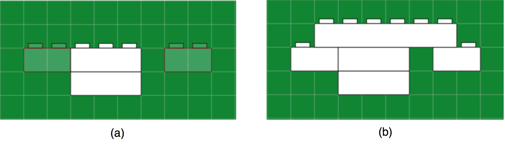

# 2D LEGO Builder

2D LEGO Builder is a system to biuld LEGO 2D models. This project is for [the final assignment from User Interface class](http://www-ui.is.s.u-tokyo.ac.jp/~takeo/course/2015/ui/assignment.htm) at the University of Tokyo.

Build with [Paper.js](http://paperjs.org/)

## How to use the system

* Upper: The field
* Below left: How many bricks left
* Below right: Clear button

### Drag and Drop on the field to generate a brick

### Drag and Drop a brick to move it

### Use right click to remove bricks

### Use "Clear" button to remove alligator

### Use arrow keys to move the field

### Make bricks connected

(a) Improper
(b) Proper

## Examples

### Elephant

### Supersaurus

### Alligator

### T. Rex

### Works made in user tests

